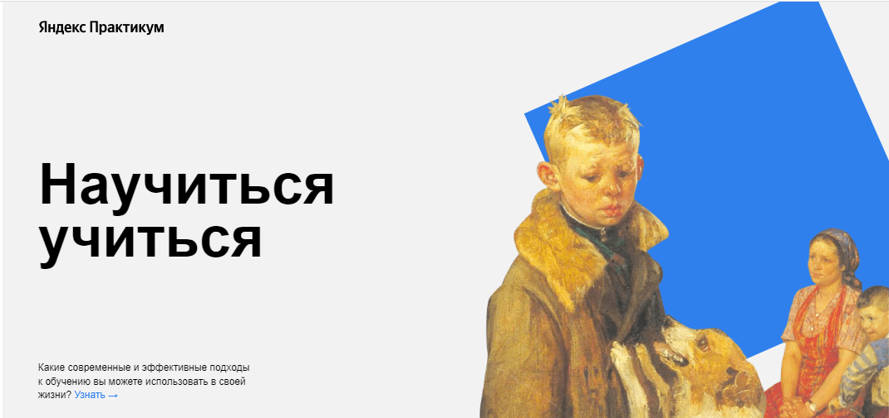

# Проект: **Научиться учиться**

## Описание проекта:
Сайт создан с целью ознакомления посетителей с проблемами и техниками обучения. Приведены несколько техник обучения, статистические и исторические данные, ссылки на полезные ресурсы.
## Технологии и функциональность:
* HTML
* CSS
* BEM Nested.
* Использованы семантические теги
* Задано необходимое позиционирование элементов, в т.ч. использование z-index
* Заданы правильные относительные пути к файлам
* Корректно добавлены iframe c видеофайлами
* Использованы анимации и трансформации
* Использованы директивы @import и @keyframes
* Ссылки активные, реагируют на курсор
## Планы по доработке:
Планируется адаптивная верстка проекта под разные разрешения экрана, в том числе под мобильные устройства.
